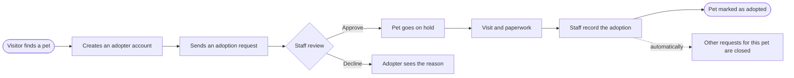

<div align="center">

# Pet Adoption System

**A complete web app for animal shelters: list pets, take adoption requests, and follow every pet from arrival to its new home.**

<p>
  
  
  
  
</p>

<p>
  <a href="#-features">Features</a> •
  <a href="#-quick-start">Quick start</a> •
  <a href="#-who-can-do-what">Roles</a> •
  <a href="#-how-an-adoption-works">Adoption workflow</a> •
  <a href="#-project-structure">Structure</a>
</p>

</div>

---

## Why it stands out

<table>
<tr>
<td width="50%" valign="top">

### Runs in one click
No database server, no web server to configure. The whole database is a single file, so the app starts with one double-click on Windows, macOS or Linux.

</td>
<td width="50%" valign="top">

### Built around adoption
From a visitor's first click to the signed papers, every step has a screen: requests, approvals, holds, and a full adoption history.

</td>
</tr>
<tr>
<td width="50%" valign="top">

### Secure by default
Role-based access, protected forms, verified uploads, private documents and sign-in lockout after repeated wrong passwords.

</td>
<td width="50%" valign="top">

### Modern and responsive
A clean, friendly design that works on phones, tablets and desktops, for visitors and staff alike.

</td>
</tr>
</table>

---

## Features

### Public website
- **Live pet gallery** showing every pet ready for adoption, with photos, age, health and vaccination status
- **Filter by type and search by name** instantly, without reloading the page
- **Pet profiles** with the full description and a one-click adoption request
- **Contact form** with spam protection; every message lands in the staff inbox
- **"How adoption works"** guide so visitors know what to expect

### Adopter and pet owner accounts
- **Adopters sign up themselves**, request pets, and follow each request live: *waiting*, *approved* or *not approved*
- Read **notes from the shelter**, cancel a request, and update contact details and password
- See every pet they've **adopted**, with the date it went home
- **Pet owners** see the pets they brought in and whether each one has found a family

### Staff dashboard
- **At-a-glance overview**: pets registered, ready for adoption, requests waiting, new inquiries
- **Adoption progress bar** and a **pets-by-type chart**
- Recently registered pets, recent adoptions and the latest staff activity
- **Menu badges** that show how many requests and messages need attention

### Records management
- **Pets**: photo, type, age, sex, description, health and vaccination status, health history and vaccination proof
- **Pet owners**, **adopters** and **pet types**, with safeguards that prevent deleting anything still in use
- Sortable, searchable tables with status filters
- Photo previews before uploading

### Adoption workflow
- **Approve or decline** requests with a note the adopter can read
- Approving automatically puts the pet **on hold**
- **Record an adoption** from a request or for walk-in adopters, and attach the signed papers
- Other people who asked for the same pet are **notified automatically**
- **Undo** a mistaken adoption in one click

### Reports
| Report | What it shows |
|---|---|
| **Adoption status** | Every pet and whether it's available, on hold or adopted |
| **Health and vaccination** | Pets needing treatment or vaccines first, plus which records are on file |
| **Pets by type** | Totals per animal type, adoptions per type and average age |
| **Pet owners** | Each owner with their pets and how many were adopted |
| **Completed adoptions** | Date, pet, adopter and the staff member who recorded it |

Every report can be **printed** or downloaded as a **CSV** that opens in Excel.

### Administration
- **Staff accounts** with two roles: *Staff* and *Administrator*
- **Shelter info** (name, logo, address, phone, website) that updates across the whole site instantly
- **One-click backups**: a `.zip` with the database *and* every photo and document
- **Activity log** recording who changed what, and when
- **Inbox** for contact-form messages, with replied/closed tracking

### Security
- Every page and action checks who is signed in and what their role allows
- Protection against cross-site request forgery on every form
- Uploads are checked by their **actual content**, not just the file name
- Health records and adoption papers are **only visible to signed-in staff**
- Passwords are securely hashed; repeated failed sign-ins lock the account for 5 minutes

---

##  Try it yourself

1. **Download** this project: click the green **Code** button above, then **Download ZIP**, and unzip it.
2. **Install Python** from [python.org](https://www.python.org/downloads/). On Windows, tick **"Add python.exe to PATH"** during setup.
3. **Start the app**: double-click **`run_windows.bat`** (on macOS or Linux, run `./run_mac_linux.sh`).

The website opens in your browser automatically. The first start takes about a minute while it sets itself up.

###  Explore the admin dashboard

Click **Sign in → Shelter staff** at the top of the site and use:

<div align="center">

| Username | Password |
|:---:|:---:|
| `admin` | `12345678` |

</div>

---

---

## Who can do what

| | Visitor | Adopter | Pet owner | Staff | Administrator |
|---|:---:|:---:|:---:|:---:|:---:|
| Browse pets and send messages | ✅ | ✅ | ✅ | ✅ | ✅ |
| Request a pet and follow the request | | ✅ | | | |
| See the status of their own pets | | | ✅ | | |
| Manage pets, owners, adopters and types | | | | ✅ | ✅ |
| Approve requests and record adoptions | | | | ✅ | ✅ |
| Reports, inbox and activity log | | | | ✅ | ✅ |
| Staff accounts, shelter info and backups | | | | | ✅ |

---

## How an adoption works



Staff can also record adoptions directly for walk-in adopters, without a request.

---

## Built with

| Layer | Technology |
|---|---|
| Backend | **Python** and **Flask** |
| Database | **SQLite**, a single file with nothing to install |
| Templates | **Jinja2** |
| Interface | **AdminLTE**, **Bootstrap 4**, **DataTables**, **Chart.js** and **Font Awesome** |
| Design | Custom theme with *Bricolage Grotesque* and *Figtree* fonts |

---

## Project structure

```
Pets-Shelter/
├── app.py                 # Start the app and run commands
├── schema.sql             # Database structure
├── requirements.txt       # Python packages
├── run_windows.bat        # One-click start on Windows
├── run_mac_linux.sh       # One-click start on macOS / Linux
├── petapp/                # Application code
│   ├── public.py          #   Public website and contact form
│   ├── portal.py          #   Adopter and pet owner accounts
│   ├── records.py         #   Pets, types, owners and adopters
│   ├── adoptions.py       #   Requests and adoption records
│   ├── admin.py           #   Dashboard, reports, inbox and backups
│   ├── accounts.py        #   Staff accounts, profile and shelter info
│   └── security.py        #   Sign-in, passwords and form protection
├── templates/             # HTML pages
├── static/                # Styles, scripts and libraries
├── instance/              # The database (created automatically)
└── uploads/               # Pet photos, logo and documents
```

---

## Using it on a network

Run `python app.py --lan`, then open `http://<this computer's IP address>:5000` from any device on the same network. That's ideal for a shelter's front desk and staff laptops.

To publish it on the internet, run it behind a production server such as **Waitress** or **Gunicorn** with HTTPS, and change the demo password first.

---

<div align="center">

**Made with care for shelters and the animals waiting for a home 🐕 🐈 🐇**

If this project helped you, consider giving it a ⭐

</div>
